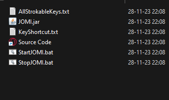

[](https://store.steampowered.com/app/271670/10_Second_Ninja/)  
https://store.steampowered.com/app/271670/10_Second_Ninja/  


## Introduction courte

Bonjour à vous, dans cet atelier, nous allons apprendre à tester un jeu à l'aide de touches clavier. Pour cela, nous allons scripter le jeu "10 seconds Ninja".

## Introduction longue

Pour simuler des touches clavier, vous avez de nombreuses possibilités en utilisant de nombreux langages.

Par exemple, à l'époque, j'avais choisi d'utiliser Java car c'est un langage interprété qui tourne sur toutes les plates-formes. Voir #JOMI.
- L'avantage de Java est qu'il tourne partout, du moins c'était la promesse.
  - La licence de Java a changé avec le temps, et il n'est plus installé par défaut sur les machines.
- Le désavantage d'un langage universel est que vous ne pouvez pas effectuer des actions qui sont natives à une plate-forme.

Pour être plus natif à la plate-forme, j'ai utilisé des bibliothèques C# pour simuler des touches. Cela accélère le développement de l'application... Mais très vite, on se retrouve limité.

Vous pouvez donc aller sous Windows au plus bas et utiliser `User32.dll` et autres. Celles-ci vous permettent de simuler des touches clavier mais demandent de comprendre beaucoup de code technique et vétuste.

Suite à cette recherche dans les archives de l'OS Windows, j'ai découvert que l'on pouvait faire croire à une application qu'elle a reçu une touche clavier. Voir : #SendMessage. Cela rend la chose très pratique, car on peut continuer de travailler pendant que l'on simule des touches clavier. Cette méthode est utilisée pour faire du #multiboxing.

Simuler du logiciel, c'est stimulant mais pas très universel, car le code ne tournera que sur la plate-forme ciblée. Pour un hack un peu plus universel, vous avez la possibilité d'utiliser des Arduinos et du Bluetooth. C'est d'ailleurs une méthode de hacking très connue car elle ne nécessite pas de droits administrateurs. Mais utiliser du hardware est un autre cours pour un autre atelier.

Touches par défaut du jeu :

- X = Valider
- X = Épée
- Z = Shuriken
- C = Niveau suivant
- R = Réessayer
- Flèches = Déplacer à gauche, à droite et sauter
- Échap = Menu


-------------------------

# Simuler des touches avec pythons

**keyboard** : Cette bibliothèque permet de contrôler et de surveiller le clavier. Elle peut également être utilisée pour simuler des frappes de touches.  
- GitHub : https://github.com/boppreh/keyboard  
- Documentation : https://pythonhosted.org/keyboard/  

**pyautogui** : Cette bibliothèque offre des fonctionnalités pour automatiser les interactions avec le clavier et la souris. Elle peut être utilisée pour simuler des pressions de touches.  
- GitHub : https://github.com/asweigart/pyautogui
- Documentation : https://pyautogui.readthedocs.io/en/latest/keyboard.html

**pynput** : Cette bibliothèque permet de contrôler et de surveiller le clavier et la souris. Elle offre des fonctionnalités pour simuler des pressions de touches.  
- GitHub : https://github.com/moses-palmer/pynput
- Documentation : https://pynput.readthedocs.io/en/latest/keyboard.html


### Import keyboard

``` py
import keyboard
import time

def simulate_key_press():
    # Simuler l'appui de la touche "A"
    keyboard.press('a')
    
    # Attendre pendant 2 secondes (vous pouvez ajuster le délai selon vos besoins)
    time.sleep(2)
    
    # Libérer la touche "A"
    keyboard.release('a')

# Appeler la fonction pour simuler l'appui de la touche
simulate_key_press()
```

-------------

### Import pyautogui

``` py
import pyautogui
import time

# Attendre quelques secondes avant de commencer
time.sleep(5)

# Simuler la pression de la touche 'A'
pyautogui.press('a')

# Attendre quelques secondes
time.sleep(2)

# Simuler la libération de la touche 'A'
pyautogui.keyUp('a')

```


### import wintypes 

Meilleur exemple de simulation de touche Windows native.
Ne perdez pas le code ;)

Attention, c'est très proche de la machine et donc un peu plus indigeste à lire.


``` py
# directkeys.py
# http://stackoverflow.com/questions/13564851/generate-keyboard-events
# msdn.microsoft.com/en-us/library/dd375731
## SOURCE https://gist.github.com/Aniruddha-Tapas/1627257344780e5429b10bc92eb2f52a
import ctypes
from ctypes import wintypes
import time

user32 = ctypes.WinDLL('user32', use_last_error=True)

INPUT_MOUSE    = 0
INPUT_KEYBOARD = 1
INPUT_HARDWARE = 2

KEYEVENTF_EXTENDEDKEY = 0x0001
KEYEVENTF_KEYUP       = 0x0002
KEYEVENTF_UNICODE     = 0x0004
KEYEVENTF_SCANCODE    = 0x0008

MAPVK_VK_TO_VSC = 0

# List of all codes for keys:
# # msdn.microsoft.com/en-us/library/dd375731
UP = 0x26
DOWN = 0x28
A = 0x41
VK1 = 0x31
VK2 = 0x32

# C struct definitions

wintypes.ULONG_PTR = wintypes.WPARAM

class MOUSEINPUT(ctypes.Structure):
    _fields_ = (("dx",          wintypes.LONG),
                ("dy",          wintypes.LONG),
                ("mouseData",   wintypes.DWORD),
                ("dwFlags",     wintypes.DWORD),
                ("time",        wintypes.DWORD),
                ("dwExtraInfo", wintypes.ULONG_PTR))

class KEYBDINPUT(ctypes.Structure):
    _fields_ = (("wVk",         wintypes.WORD),
                ("wScan",       wintypes.WORD),
                ("dwFlags",     wintypes.DWORD),
                ("time",        wintypes.DWORD),
                ("dwExtraInfo", wintypes.ULONG_PTR))

    def __init__(self, *args, **kwds):
        super(KEYBDINPUT, self).__init__(*args, **kwds)
        # some programs use the scan code even if KEYEVENTF_SCANCODE
        # isn't set in dwFflags, so attempt to map the correct code.
        if not self.dwFlags & KEYEVENTF_UNICODE:
            self.wScan = user32.MapVirtualKeyExW(self.wVk,
                                                 MAPVK_VK_TO_VSC, 0)

class HARDWAREINPUT(ctypes.Structure):
    _fields_ = (("uMsg",    wintypes.DWORD),
                ("wParamL", wintypes.WORD),
                ("wParamH", wintypes.WORD))

class INPUT(ctypes.Structure):
    class _INPUT(ctypes.Union):
        _fields_ = (("ki", KEYBDINPUT),
                    ("mi", MOUSEINPUT),
                    ("hi", HARDWAREINPUT))
    _anonymous_ = ("_input",)
    _fields_ = (("type",   wintypes.DWORD),
                ("_input", _INPUT))

LPINPUT = ctypes.POINTER(INPUT)

def _check_count(result, func, args):
    if result == 0:
        raise ctypes.WinError(ctypes.get_last_error())
    return args

user32.SendInput.errcheck = _check_count
user32.SendInput.argtypes = (wintypes.UINT, # nInputs
                             LPINPUT,       # pInputs
                             ctypes.c_int)  # cbSize

# Functions

def PressKey(hexKeyCode):
    x = INPUT(type=INPUT_KEYBOARD,
              ki=KEYBDINPUT(wVk=hexKeyCode))
    user32.SendInput(1, ctypes.byref(x), ctypes.sizeof(x))

def ReleaseKey(hexKeyCode):
    x = INPUT(type=INPUT_KEYBOARD,
              ki=KEYBDINPUT(wVk=hexKeyCode,
                            dwFlags=KEYEVENTF_KEYUP))
    user32.SendInput(1, ctypes.byref(x), ctypes.sizeof(x))

if __name__ == "__main__":
    while True:
        PressKey(VK1)
        time.sleep(1)
        ReleaseKey(VK1)
        time.sleep(1)
        PressKey(VK2)
        time.sleep(1)
        ReleaseKey(VK2)
        print("Pressed")
        PressKey(0x67)
        time.sleep(1)
        ReleaseKey(0x67)
        time.sleep(1)
        PressKey(0x69)
        time.sleep(1)
        ReleaseKey(0x69)
        print("Pressed")
```


-------------

### SendMessage 
 
Sur Windows, la fonction `SendMessage` permet d'envoyer des informations diverses à une application. Dans ces informations, vous avez la capacité d'envoyer des touches.

L'ordinateur étant une machine qui ne fait que calculer, plus vous vous rapprochez d'elle, plus vous devrez utiliser des nombres hexadécimaux et du binaire. Tel que `VK_X = 0x58`.


```py
import ctypes
import time

# Constants for SendMessage
WM_KEYDOWN = 0x0100
WM_KEYUP = 0x0101

# Virtual key codes
VK_X = 0x58
VK_LEFT = 0x25
VK_UP = 0x26
VK_RIGHT = 0x27
VK_DOWN = 0x28
VK_Z = 0x5A
VK_R = 0x52

timebetweenaction=0.1
timepress=0.1

# Find the window by its title
def find_window(title):
    return ctypes.windll.user32.FindWindowW(None, title)

# Send key press using SendMessage
def send_key(hwnd, key_code):
    ctypes.windll.user32.SendMessageW(hwnd, WM_KEYDOWN, key_code, 0)
    time.sleep(timepress)  # Optional delay between keydown and keyup
    ctypes.windll.user32.SendMessageW(hwnd, WM_KEYUP, key_code, 0)

if __name__ == "__main__":
    # Replace "Your Window Title" with the title of the window you want to send keys to
    window_title = "10 Second Ninja"
    hwnd = find_window(window_title)

    if hwnd:
        while True:
            send_key(hwnd, VK_X)
            time.sleep(timebetweenaction)
            send_key(hwnd, VK_RIGHT)
            time.sleep(timebetweenaction)
            send_key(hwnd, VK_UP)
            time.sleep(timebetweenaction)
            send_key(hwnd, VK_DOWN)
            time.sleep(timebetweenaction)
            send_key(hwnd, VK_Z)
            time.sleep(timebetweenaction)
            send_key(hwnd, VK_R)
        
    else:
        print(f"Window with title '{window_title}' not found.")
```


# Lire des touches avec Python

C'est bien beau de simuler des touches, mais il faut encore savoir les lire. Voici deux-trois outils pour lire des touches.

## Écouter l'état d'une touche


``` py
import keyboard
import time

def ecouter_touche(touche):
    enfoncee = False

    try:
        while True:
            # Vérifier si la touche est enfoncée
            if keyboard.is_pressed(touche):
                if not enfoncee:
                    print(f"Touche {touche} enfoncée.")
                    enfoncee = True
            else:
                if enfoncee:
                    print(f"Touche {touche} relâchée.")
                    enfoncee = False
            time.sleep(0.1)  # Pour éviter une utilisation excessive du processeur
    except KeyboardInterrupt:
        pass

# Touche à écouter (vous pouvez remplacer par la touche de votre choix)
touche_a_ecouter = 'a'

# Démarrer l'écoute de la touche
ecouter_touche(touche_a_ecouter)
```


### Utiliser un système d'abonnement (hook)

Écouter l'état d'une touche peut laisser échapper une frappe rapide. Parfois, il est préférable de s'abonner à son changement directement.


``` py
import keyboard
import threading
import time

def on_key_event(e):
    if e.event_type == keyboard.KEY_DOWN:
        print(f"Touche {e.name} enfoncée.")
    elif e.event_type == keyboard.KEY_UP:
        print(f"Touche {e.name} relâchée.")

def hook_thread():
    # Touche à surveiller (vous pouvez remplacer par la touche de votre choix)
    touche_a_surveiller = 'a'

    # Abonner la fonction on_key_event au hook de la touche spécifiée
    keyboard.hook_key(touche_a_surveiller, on_key_event)

    # Garder le thread actif
    keyboard.wait('esc')  # Attendre que la touche 'Esc' soit enfoncée pour terminer le thread

# Créer un thread pour exécuter le hook
hook_thread = threading.Thread(target=hook_thread)

# Démarrer le thread
hook_thread.start()

# Faire d'autres tâches dans le thread principal
try:
    while True:
        print("Programme principal en cours d'exécution...")
        time.sleep(1)
except KeyboardInterrupt:
    pass

# Attendre que le thread du hook se termine
hook_thread.join()
```


### Écouter les touches peut être illégal.

Évidemment, notre but ici est de créer des outils de test. Cependant, il faut prendre en compte que une application ne devrait pas écouter les touches de l'utilisateur.

Si vous voulez écouter les touches seulement dans votre application, l'utilisation de pygame peut être plus adaptée.


``` py
import pygame
import sys

pygame.init()

# Créer une fenêtre (inutile pour ce programme, mais Pygame l'exige)
pygame.display.set_mode((100, 100))

# Touche à surveiller (vous pouvez remplacer par la touche de votre choix)
touche_a_surveiller = pygame.K_a

def ecouter_touche():
    while True:
        for event in pygame.event.get():
            if event.type == pygame.KEYDOWN and event.key == touche_a_surveiller:
                print(f"Touche {pygame.key.name(event.key)} enfoncée.")
            elif event.type == pygame.KEYUP and event.key == touche_a_surveiller:
                print(f"Touche {pygame.key.name(event.key)} relâchée.")

try:
    # Créer un thread pour écouter la touche
    pygame_thread = threading.Thread(target=ecouter_touche)

    # Démarrer le thread
    pygame_thread.start()

    # Continuer le programme principal
    while True:
        pygame.time.delay(1000)  # Attendre une seconde
        print("Programme principal en cours d'exécution...")

except KeyboardInterrupt:
    pass
finally:
    pygame.quit()  # Assurez-vous de quitter correctement Pygame à la fin du programme
```


------------------------


# JOMI

Java Open Macro Input est une application portable en Java qui me permet, via de l'UDP, d'injecter des touches clavier. Très utile, elle est contrôlable depuis un réseau UDP. Pour cela, vous avez besoin d'une adresse IP et d'un port.

Vous pouvez trouver une version du logiciel dans ce dépôt Git, ou en ligne : [](https://github.com/EloiStree/2020_04_10_JavaOpenMacroInputRuntime)

[Repository GitHub](https://github.com/EloiStree/2020_04_10_JavaOpenMacroInputRuntime)



Voici un exemple de comment l'utiliser en Python via UDP : [Source](https://github.com/EloiStree/2020_04_10_JavaOpenMacroInputRuntime/blob/master/HelloWorld.py)


``` py

import socket
import time
import datetime
#Type 'python' in the command line to install python.
def sendmessage(msg):
  print("message: %s" % msg)
  sock = socket.socket(socket.AF_INET, socket.SOCK_DGRAM)
  sock.sendto(msg.encode(), (UDP_IP, UDP_PORT))
def trycmd(msg,description):
  print("")
  print("Try to do: %s" % description)
  print("Sent: %s" % msg)
  print("")
  sock = socket.socket(socket.AF_INET, socket.SOCK_DGRAM)
  sock.sendto(msg.encode(), (UDP_IP, UDP_PORT))
  time.sleep(1)
def linereturn():
  sock = socket.socket(socket.AF_INET, socket.SOCK_DGRAM)
  sock.sendto("sc:Enter↕".encode(), (UDP_IP, UDP_PORT))
  time.sleep(0.1)


UDP_IP = "127.0.0.1"
UDP_PORT = 2501

#START
print("UDP target IP: %s" % UDP_IP)
print("UDP target port: %s" % UDP_PORT)
print("You have 3 seconds when enter is press to go in a text editor")
input("Press Enter to continue...")

# Count Down
print("3...")
time.sleep(1)
print("2...")
time.sleep(1)
print("1...")
time.sleep(1)

# Hello World
trycmd("sc: [[Hello World]]"
  ,"Write 'Hello World'")
linereturn()
# Use t:hh-mm-ss-ms: 
now=datetime.datetime.now()
t=('t:%02d-%02d-%02d-0:'%(now.hour,now.minute,now.second+1))
trycmd(t+"sc: [[It is time]] Enter↕" ,"")
sendmessage("tms:100:sc:shift+t")
sendmessage("tms:300:ks:i")
sendmessage("tms:500:ks:m")
sendmessage("tms:600:ks:e")
sendmessage("tms:800:ks:vk_enter")
sendmessage("tms:900:sc:[[!]] 100> [[!]] 100> [[!]]")
sendmessage("tms:1400:ks:vk_enter")
sendmessage("tms:1600:sc:( [[! ]] 100> ) x 10 ")
time.sleep(4)
linereturn()
# Basic
trycmd("ks:VK_ENTER","Stroke Enter key")
trycmd("ks:VK_A","Stroke 'a'")
trycmd("kp:VK_B","Press 'b'")
trycmd("kr:VK_B","Release 'b'")
trycmd("ks:a","Stroke A alias of VK_A if it exists")
trycmd("ksc:ks:d裂ks:e","Group two commands splite by 裂")
linereturn()
trycmd("past:I love the patato"
  ,"Past from clipboard a text")
trycmd(t+"sc: ctrl+a"
  ,"Select all the text")
trycmd("clipboard:copy","Use clipboard to copy")
linereturn()
trycmd("clipboard:past","Use clipboard to past")
linereturn()
trycmd("clipboard:past","Use clipboard to past")
linereturn()
trycmd(t+"sc: ctrl+a"
  ,"Select all the text")
linereturn()
trycmd("clipboard:copypast","Use clipboard to copy then past")
linereturn()
# https://unicode-table.com/en/1F9F0/
trycmd("unicode:129520","Write a unicode with int number")
trycmd("unicode:U+1F9F0","Write a unicode with hexa decimal")
linereturn()


time.sleep(3)
trycmd("mm:0.1%:0.7%","L T")
trycmd("ms:l","")
trycmd("mm:0.9%:0.7%","R T")
trycmd("ms:l","")
trycmd("mm:0.1%:0.2%","L D")
trycmd("ms:l","")
trycmd("mm:0.9%:0.2%","R D")
trycmd("ms:l","")

##trycmd("sc:alt↕ h↕ b↕","Brush")
trycmd("mm:0.173%:0.935%","L T")
trycmd("ms:l","")
trycmd("mm:0.5%:0.5%","L T")
trycmd("ms:l","")

trycmd("mm:0.1%:0.7%","L T")
trycmd("mp:l","")
trycmd("mm:0.9%:0.7%","R T")
trycmd("mr:l","")

#trycmd("mm:0.9%:0.98%","R T")
#trycmd("ms:r","")

trycmd("mm:0.5%:0.5%","R T")
trycmd("ms:l","")

trycmd("mm:0.5%:0.5%","R T")
trycmd("mp:l","")
trycmd("ma:60px:0px","")
trycmd("ma:0px:-60px","")
trycmd("ma:-60px:0px","")
trycmd("ma:0px:60px","")

trycmd("ma:-0.05p:0.0p","")
trycmd("ma:0.0p:0.05p","")
trycmd("ma:0.05p:0.0p","")
trycmd("ma:0.0p:-0.05p","")
trycmd("mr:l","")

trycmd("sc:🐁A↓0.3←0.3px 10> 🐁LeftClick ","R T")
trycmd("sc:🐁A→100↑100 10> 🐁LeftClick ","R T")


trycmd("sc:( 🐁→10 10> 🐁LeftClick 10>)x20  ","R T")
trycmd("sc:( 🐁↑10 10> 🐁LeftClick 10>)x20  ","R T")
trycmd("sc:( 🐁←10 10> 🐁LeftClick 10>)x10  ","R T")
trycmd("sc:( 🐁↓10 10> 🐁LeftClick 10>)x5  ","R T")
trycmd("sc:( 🐁→0.01% 10> 🐁l 10>)x20  ","R T")
trycmd("sc:( 🐁↑0.01% 10> 🐁l 10>)x20  ","R T")
trycmd("sc:( 🐁←0.01% 10> 🐁l 10>)x10  ","R T")
trycmd("sc:( 🐁↓0.01% 10> 🐁l 10>)x5  ","R T")
trycmd("sc:( 🐁↑0.005→20px 10> 🐁l 10>)x5  ","R T")
trycmd("sc:( 🐁↑20px→0.005% 10> 🐁l 10>)x5  ","R T")
trycmd("sc:( leftclick↓ 10> 🐁→200px leftclick↑ 10>)x1  ","R T")
trycmd("sc:( leftclick↓ 10> 🐁↑200px leftclick↑ 10>)x1  ","R T")
trycmd("sc:( leftclick↓ 10> 🐁←200px leftclick↑ 10>)x1  ","R T")
trycmd("sc:( leftclick↓ 10> 🐁↓200px leftclick↑ 10>)x1  ","R T")

trycmd("img2clip:https://i.imgflip.com/4k39g9.jpg","")
trycmd("sc:ctrl+v 1000> ctrl+v  ","")
trycmd("sc: ( ctrl+pagedown )x5","")

trycmd("ks:VK_A","Stroke 'a'")
trycmd("kp:VK_B","Press 'b'")
trycmd("kr:VK_B","Release 'b'")

for x in range(40):
  sendmessage("wh:-1")
  time.sleep(0.1)
for x in range(40):
  sendmessage("wh:1")
  time.sleep(0.1)
  

``` 


